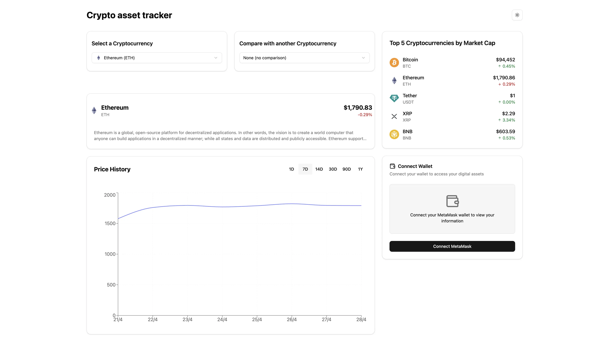

# Crypto Asset Traker 📊



## Overview

Crypto Asset Traker is a responsive cryptocurrency tracking web application built with React, TypeScript, and Tailwind CSS. It offers insights into cryptocurrency prices, historical performance, and market trends, combined with wallet integration.

## 🌟 Features

- **Cryptocurrency Data**: Access the latest market prices and trends.
- **Interactive Price Charts**: Compare multiple cryptocurrencies across various timeframes.
- **Top Movers**: Quickly spot the biggest market movements.
- **Wallet Connection**: Seamless MetaMask integration to connect your crypto wallet.
- **Responsive Design**: Fully optimized for desktop, tablet, and mobile.
- **Dark/Light Theme Toggle**: Smooth transitions between themes with a polished visual experience.

## 🛠 Technologies Used

- React 19
- TypeScript
- Tailwind CSS
- Shadcn UI
- Recharts
- Redux Toolkit
- Vite
- Vitest (testing)

## 🔎 App Preview

You can try out a live preview of Crypto Asset Tracker here:

[🔗 View Live Demo](https://crypto-asset-tracker-mu.vercel.app/)

Explore the full functionality, including wallet connection, portfolio tracking, and real-time cryptocurrency data visualization.

## 🚀 Getting Started

### Prerequisites

- Node.js (v18+ recommended)
- npm

### Installation

1. Clone the repository:

   ```bash
   git clone https://github.com/oscar-castaneda-dev/crypto-asset-tracker.git
   cd crypto-asset-tracker
   ```

2. Install dependencies:

   ```bash
   npm install
   ```

3. Set up environment variables:

   - Copy the provided `.env.example` file to a new `.env` file:
     ```bash
     cp .env.example .env
     ```
   - Inside `.env`, replace `your_api_key` with your actual CoinGecko API key:
     ```env
     VITE_COINGECKO_API_KEY=your_actual_api_key
     ```

For more information about setting up your API key, please refer to the official documentation [here](https://docs.coingecko.com/reference/setting-up-your-api-key).

4. Start the development server:

   ```bash
   npm run dev
   ```

5. Open [http://localhost:5173/](http://localhost:5173/) in your browser.

## 📦 Available Scripts

- `npm run dev` — Start the development server.
- `npm run build` — Build the project for production.
- `npm run preview` — Preview the production build locally.
- `npm run test` — Run the project's test suite.

## 🧪 Running Tests

Crypto Asset Traker uses **Vitest** for testing.  
To run all tests:

```bash
npm run test
```

## 🔐 Wallet Connection

Crypto Asset Tracker supports MetaMask wallet integration.

Features include:

- **Connect Wallet**: Prompt users to connect their MetaMask wallet to access their digital assets.
- **View Portfolio Value**: After connecting, users can see their total portfolio value in dollars.
- **View ETH Price and 24h Change**: Display the current Ethereum (ETH) price and the 24-hour percentage change.
- **Performance Overview**:
  - Estimated performance over the last 24 hours.
  - Comparison of current portfolio value vs. 24h ago.
  - Display of profit or loss in USD.
- **Wallet Information Tab**:
  - Display connected wallet address (partially masked for security).
  - Show wallet ETH balance.
  - Display network information (e.g., Ethereum Mainnet).
- **Disconnect Wallet**: Allow users to safely disconnect their wallet at any time.

## 📈 Crypto Data Sources

All cryptocurrency market data is retrieved in real-time using the **CoinGecko API**.

Supported features:

- Current market prices
- Historical price data
- Top movers by market change

> **Important**: You need a valid API key configured via the `.env` file to fetch data properly.

## 🤝 Contributing

We welcome contributions!

Follow these steps to contribute:

1. Fork the repository.
2. Create a new branch:
   ```bash
   git checkout -b feature/YourFeatureName
   ```
3. Commit your changes:
   ```bash
   git commit -m "Add YourFeatureName"
   ```
4. Push your branch:
   ```bash
   git push origin feature/YourFeatureName
   ```
5. Open a Pull Request.

## 📄 License

Crypto Asset Traker is licensed under the [MIT License](LICENSE).

## 🎉 Acknowledgements

Special thanks to the libraries and APIs that made this project possible:

- [Shadcn UI](https://ui.shadcn.com/)
- [Recharts](http://recharts.org/)
- [CoinGecko API](https://coingecko.com/)
